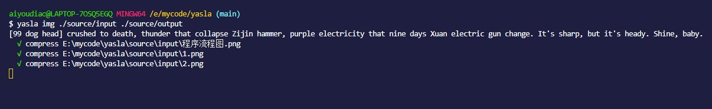

<p align="center">
    
</p>

# yasla（Compression Killed!）

Multi-function compression tool

[](https://www.npmjs.com/package/yasla)

- [yasla（Compression Killed!）](#yaslacompression-killed)
  - [🌝 yasla Why？](#-yasla-why)
  - [🔥 Feature list](#-feature-list)
  - [✨ Used to introduce](#-used-to-introduce)
    - [⚔️ Installation guide](#️-installation-guide)
    - [📈 Method of use](#-method-of-use)
    - [😎 See the effect](#-see-the-effect)
  - [📚 Quick use](#-quick-use)
  - [Code warehouse](#code-warehouse)
  - [📞 Community communication](#-community-communication)
    - [Thanks for the following](#thanks-for-the-following)

---

## 🌝 yasla Why？

yasla，When you need to compress, you can try it.  
Install ME, ALL copy down, who use WHO COOL [DOG HEAD to save life], interactive operation, very simple.

🚀 Support：  

- [[√]] images：Mainstream Image Formats  
- [[x]] music: Mainstream Music formats  
- [[x]] video: Mainstream Video Formats
- [[x]] code: Mainstream Code format
- [[x]] file: Mainstream File format

- ✂️ Light weight: ES6 object-oriented code writing, good extensibility, vitest unit testing and typescript support will be added later.
- ⚡ Strong：Interactive operation, can be used globally as a command line tool, also can be used as a third party dependency package.
- 💉 Good：Support a variety of resource formats, real-time synchronous compression, compression effect is good。
- ⚙️️ Simplicity: With fine-grained apis and coarse-grained apis, the command line is much simpler.


| nodejs | npm   | size   |
| ------ | ----- | ------ |
| > 12.0 | > 6.0 | ignore |

## 🔥 Feature list

The program can run on both Windows and UnUX-like computers：

| api                                  | result                                                                                                                    |
| ------------------------------------ | ------------------------------------------------------------------------------------------------------------------------- |
| yasla                                | Open the help document for the Yasla program                                                                              |
| yasla img inputPath outputPath       | Compress the images in the specified directory to the target directory and listen to the specified directory in real time |
|                                      |
| yasla img inputPath outputPath -once | Compresses the images in the specified directory to the destination directory, only once                                  |
| ...                                  | Follow-up functions to be done and optimized                                                                              |

---

## ✨ Used to introduce

### ⚔️ Installation guide

Global installation, used as a command line tool：

```bash
    npm install -g yasla
```

---

Install as a third party dependency(TODO)：

```bash
    npm install yasla
```

### 📈 Method of use

To use globally (use after global installation), enter the following commands line by line in the command line tool:

```bash
    cd target-directory
    yasla
```

---

For partial use (as a third party dependency package), copy and paste the following code in the JS file in the Node environment：

```javascript
// TODO
```

---

### 😎 See the effect



---

## 📚 Quick use

**install**->**use**

## Code warehouse

[github link](https://github.com/aiyoudiao/yasla)

## 📞 Community communication

If you have any questions, you can raise them in the Github issue. If you are interested, you can also add wechat to communicate:


### Thanks for the following

Thank you very much

Tool：

- boxen
- chalk
- chokidar
- commander
- fast-glob
- figlet
- file-type
- fs-extra
- inquirer
- listr
- package-json
- pkg-types
- semver
- typescript
- unconfig
- vitest
- bumpp
- @antfu/eslint-config
- @changesets/cli

Warehouse：

- Simon-He95/tiny-tinify-compress
- minjs1cn/any-tiny  
- sudongyuer/easy-tinypng-cli